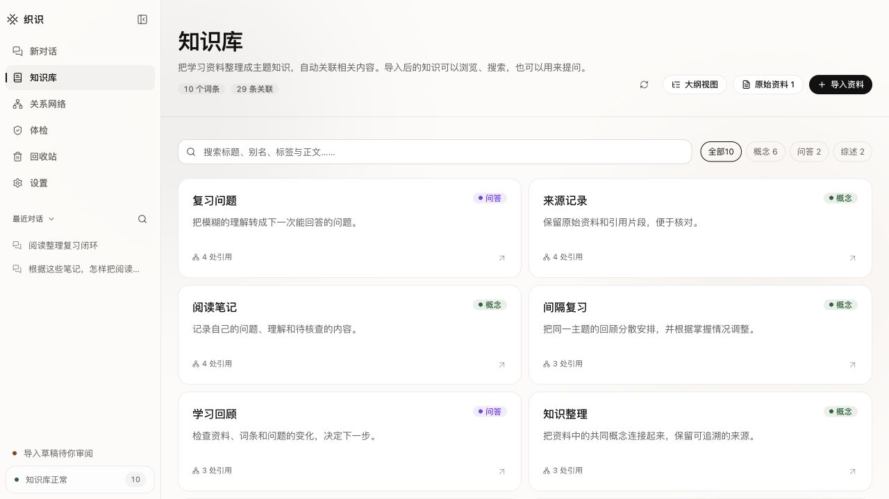
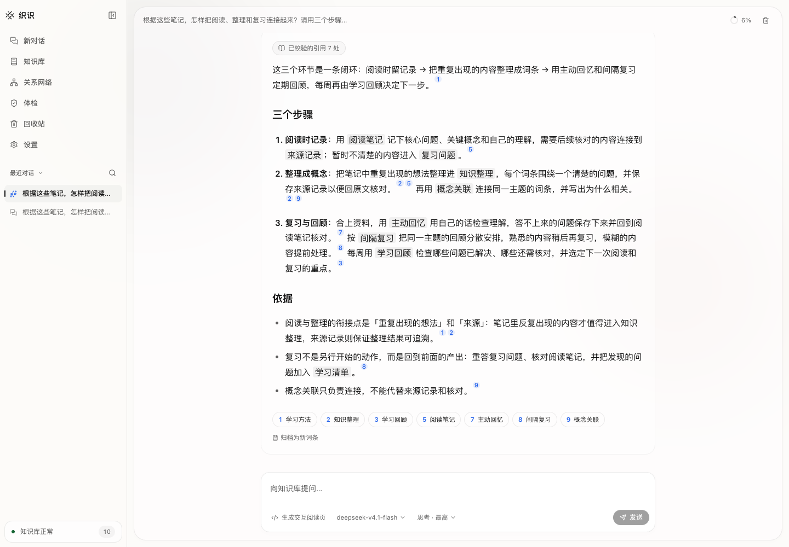
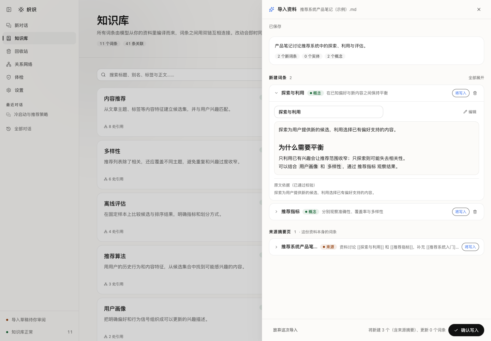
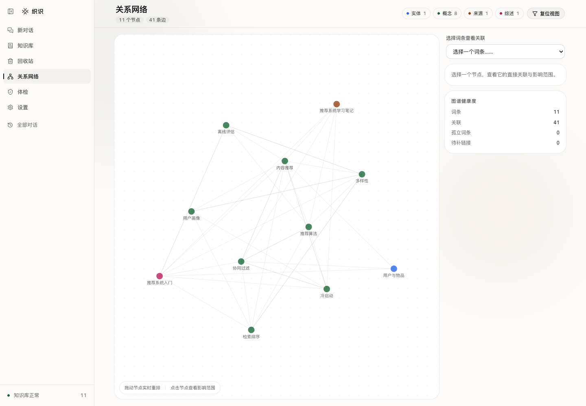

# 织识 · weave

[](https://github.com/qinyuhao84-ship-it/weave/actions/workflows/ci.yml) · [MIT](LICENSE) · Next.js / TypeScript / SQLite

**把散落的资料编译成互相链接、可以持续维护的个人知识库。**

*A local-first knowledge wiki: turn your documents into linked Markdown pages, review changes, and ask questions with citations.*

织识是一个 **开源、本地运行、单用户**的知识管理工具，受 [Karpathy 的 LLM Wiki 理念](https://gist.github.com/karpathy/442a6bf555914893e9891c11519de94f)启发。模型从资料中生成 Markdown 词条，经人工审阅写入，再用于检索问答与知识库体检。使用者自行配置模型服务，资料保存在自己的电脑上。

## 下载桌面应用

[下载 macOS Apple Silicon 安装包](https://github.com/qinyuhao84-ship-it/weave/releases/download/v0.2.0/Weave-0.2.0-macOS-arm64.dmg) · [更新说明与校验和](https://github.com/qinyuhao84-ship-it/weave/releases/tag/v0.2.0) · [安装说明](docs/desktop.md)

打开 `.dmg`，将「织识」拖到「Applications」，再从应用程序打开。内置 Node 与本地备份所需的 Git，日常使用无需安装 Node、pnpm 或启动终端。此版为未经过 Apple 公证的桌面预览版，仅提供 Apple Silicon 包；实际验收环境为 macOS 15.7.4。模型仍需在应用设置中自行配置。

## 真实评测与优化

固定种子和数据版本的中文真实资料评测，独立留出集通过本阶段全部工程门槛：Recall@10 **98.68%**、nDCG@10 **0.8536**，比开发预选最强基线高 **4.19 个百分点**（95% 区间 1.85–6.63）。80 道有答案场景正确率 **97.5%**、引用支持 **100%**，20 道受控缺证据场景正确拒答 **100%**。本地 P95 相对原实现增加 9.97%，失败与降级为零。

最终留出检索 200 题、共享语料 10,080 篇；问答为另行冻结的 80+20 个场景。检索按公开人工标注自动计分，问答由 Codex 逐题核对实际证据，标记为 agent-assisted。

| 指标 | 结果 | 如何理解 |
| --- | --- | --- |
| Recall@5 / @10 | 88.94% / 98.68% | 找回的已标注相关资料比例 |
| Hit@5 / @10 | 98.00% / 99.50% | 至少找到一条相关资料的问题比例 |
| MRR@10 / nDCG@10 | 0.8421 / 0.8536 | 第一条正例的位置 / 整体排序质量，越接近 1 越好 |
| Precision@5 / @10 | 36.00% / 21.20% | 前 K 条中已标注正例比例，未标注按 0 计 |
| 已标注结果准确率 / 标注覆盖率@10 | 26.13% / 80.95% | 有标注结果中的正例比例 / 返回结果有标注的比例 |
| 实际片段证据覆盖 | 80/80，100% | CMRC 答案原文在送入模型的片段中，包含截断检查 |
| 本地检索中位数 / P95 | 87.85 / 122.67 ms | 排除嵌入和重排网络等待；相对原实现 P95 +9.97% |
| 问答端到端首字 / 完成 P95 | 3,150 / 3,216 ms | 100 个场景的真实模型请求，包含检索准备 |

Precision 受不完整标注限制，不能直接当作所有结果的真实准确率；Recall 也不等于准确率。缓存重放只用于质量比较，真实嵌入与重排网络耗时另报。[指标定义、样本量和基线对比](docs/evaluation/2026-10-02/metrics.md) · [完整结果、失败轮次与限制](docs/evaluation/2026-10-02/README.md) · [复现命令](docs/retrieval-evaluation.md)。结果仅代表本受限评测，不是市场产品平均水平。

## 为什么做织识

收藏文件不等于形成知识：同一个概念散落在不同资料里，相关结论难以连接，资料更新后也很难发现旧知识已经过时。织识把“读资料”延伸成一个可以回溯的循环：

```text
资料 → 模型分析 → 人工审阅 → Markdown 词条与双链
                                ↓
                    检索问答 → 引用核对 → 归档与维护
```

你可以先整理一组学习笔记，把重复出现的概念编译为词条，再围绕问题检索证据；新增资料时继续补充知识，并由体检流程协助发现死链、重复与潜在矛盾。



> 界面截图使用临时知识库与合成学习笔记。问答与导入建议来自本地模拟模型，展示操作流程，不代表真实模型质量；不含个人资料或真实服务凭据。[截图说明](docs/screenshots/README.md)

## 核心流程

- **导入与编译**：支持文本、Markdown、HTML、DOCX、数字 PDF；生成新词条、更新建议和矛盾事项，审阅确认后写入。可选 Docling 支持 PPTX 和扫描 PDF。
- **检索与问答**：SQLite FTS5 检索相关词条，按预算组装上下文，流式回答并由后端校验引用；答案可归档为词条，也可生成独立 HTML 阅读文件。
- **维护与恢复**：编辑、搜索、合并词条，浏览图谱，检查死链与语义问题；导入草稿自动保存，长任务支持恢复，删除内容可从回收站恢复。

Markdown 是词条真源，可用 Obsidian 或文本编辑器打开。SQLite 还保存不可由 Markdown 重建的聊天、来源、草稿和审阅记录，必须一同备份。

## 界面预览

### 带引用的知识问答

根据相关词条回答问题，查看证据，再把有用的回答归档为知识。



### 资料写入前的人工审阅

查看模型建议、编辑草稿并确认写入；用户决定知识库最终保存什么。



### 双链图谱

从概念关系进入词条，查看关联内容，发现知识之间的联系。



## 快速开始

首版正式支持 **macOS**；Linux 有 CI 回归配置，Windows 尚未验收。需要 Git、Node.js **26.3.1**、pnpm **11.7.0**。Node 版本见 `.node-version`。

安装指定 Node 后，安装 pnpm 并克隆仓库：

```bash
npm install --global pnpm@11.7.0
git clone https://github.com/qinyuhao84-ship-it/weave.git
cd weave
pnpm install --frozen-lockfile
pnpm build
pnpm start
```

打开 [http://127.0.0.1:3000](http://127.0.0.1:3000)。更换端口可运行 `pnpm start -- -p 3001`。开发使用 `pnpm dev`；日常使用生产构建，避免热更新中断任务。

**无需 `.env` 或模型凭据即可启动。** 默认知识库为 `~/Documents/织识`，目录和数据库自动创建；构建使用临时知识库。没有配置模型时仍可浏览与编辑，导入分析和问答会提示配置服务。

### 首次使用

1. 打开「设置 → 模型服务」，添加服务。云端服务填写自己的 Key；本地无认证服务可留空。
2. 读取模型列表并选择型号，或手动填写模型名。自定义基础地址需兼容 `/chat/completions`，不要把该路径加进基础地址。
3. 测试连接并保存。连接测试会发送一条不包含知识资料的短问题，可能消耗额度；新任务立即使用保存的配置。
4. 导入一份小资料，修改草稿并确认写入；随后提问、查看引用并尝试归档答案。

在「设置 → 混合检索」独立配置嵌入和重排服务，再启用文字＋向量召回。默认模板使用硅基流动 `BAAI/bge-m3` 和 `BAAI/bge-reranker-v2-m3`；准确模型名、免费状态和账号权限以[官方价格页](https://siliconflow.cn/pricing)为准。启用会将词条分段和查询发给该服务，重排仅发送召回候选。后台逐步更新向量；服务失败仍可使用本地文字检索，关闭或保存新配置会取消旧索引请求。密钥不通过设置接口回显。

「设置 → 语言」可切换简体中文／English，立即生效并记住选择；知识正文和模型回答保留原语言。

供应商模板只填充地址，不保证账号权限、区域或所有型号都支持相同协议。未知模型默认不发送思考档位；上下文容量和高级参数应以服务文档为准。生成质量需要用自己的资料和模型验证。

### 可选配置

通过环境文件配置模型或路径时，运行 `cp .env.example .env.local`，只取消需要的示例行注释。真实环境文件已被 Git 忽略。

首次启动优先使用进程环境变量，再使用 Next 加载的 `.env*`，最后使用本地保存配置。界面保存或切换模型后，本地服务优先；删除全部本地服务后恢复环境兜底。修改环境文件需要重启。保存表达偏好不会将环境凭据复制进数据库。

`WEAVE_VAULT` 指定完整知识库路径，设置后不能通过界面迁移。`WEAVE_CONFIG_DIR` 指定位置配置目录；macOS 默认使用 `~/Library/Application Support/Weave`。界面迁移会在重启时复制并校验完整知识库，目标已存在且内容不同则停止。

需要 OCR 或 PPTX 时，先安装 [uv](https://docs.astral.sh/uv/getting-started/installation/)，再运行：

```bash
pnpm docling:install
pnpm start
```

启动命令自动启动或复用本机 Docling；首次解析可能下载 OCR 模型。也可通过 `DOCLING_ENDPOINT` 指定服务。未安装时，基础格式与数字 PDF 仍可使用，扫描 PDF 和 PPTX 会明确提示缺少解析能力。

## 数据、隐私与备份

- 标准启动只监听本机回环地址，API 校验 Host 与 Origin。当前没有账号认证，不支持公网或局域网共享部署；启动命令关闭 Next 遥测。
- 界面保存的 Key 和附加请求头存于本地 SQLite，**不加密、不通过设置 API 回显**。可使用环境变量避免凭据落库。
- 远程模型会收到任务所需的资料片段或会话内容；远程 Docling 会收到待解析文件。服务和费用由使用者自行选择。
- 代码仓库与知识库应放在独立目录。知识库的 Git 仅用于本地内容备份；应用不会将其推送到 GitHub。

```text
~/Documents/织识/
├── raw/       原始资料
├── wiki/      实体、概念、来源、问答与综述
├── index.md   生成目录
├── log.md     操作记录
├── schema.md  治理规则
├── .git/      本地内容版本记录
└── .weave/    SQLite、解析稿、任务检查点和回收站
```

**停止服务后复制整个知识库，包括隐藏的 `.git` 和 `.weave`。** 仅备份 Markdown 无法恢复完整应用状态；环境文件需单独保存。回收站永久清理不删除已有 Git 历史或外部备份。

升级前先完整备份，再运行 `git pull --ff-only`、`pnpm install --frozen-lockfile`、`pnpm build`、`pnpm start`。数据库迁移自动执行；回退代码不能代替恢复升级前的数据库备份。不要让两个进程同时使用同一知识库。

## 常见问题

| 情况 | 处理 |
| --- | --- |
| 安装报版本不匹配 | 使用上述固定 Node 和 pnpm 版本 |
| 模型授权或请求失败 | 检查 Key、基础地址、准确模型名、额度及必需请求头 |
| 不支持模型列表 | 手动填写型号，并通过连接测试检查生成权限 |
| 端口占用 | 停止旧进程，或使用 `pnpm start -- -p 3001` |
| 重启后迁移失败 | 检查目标冲突、权限和磁盘空间，保留原知识库 |
| 任务中断 | 导入与体检复用已保存检查点；未完成的单次模型请求可能重做；聊天保留已保存正文 |

## 工程与贡献

采用 Next.js App Router、React、TypeScript、Drizzle 和 SQLite。项目介绍与技术要点见 [项目说明](docs/project-introduction.md)。架构与取舍见 [架构说明](docs/architecture.md)，复测方法见 [性能基准](docs/performance-audit.md)，交付结果见 [验收记录](docs/validation.md)和[代码审计](docs/release-audit.md)。上线回归状态见 [GitHub Actions](https://github.com/qinyuhao84-ship-it/weave/actions)。

```bash
pnpm lint
pnpm build
pnpm typecheck
pnpm test
pnpm exec playwright install chromium
pnpm test:e2e
```

测试使用临时知识库与模拟模型，不需要真实密钥。若已安装 Chrome，可用 `WEAVE_E2E_BROWSER_CHANNEL=chrome pnpm test:e2e`；独立无界面进程不会读取日常浏览器资料。

当前适合个人、中等规模知识库。模拟测试证明流程和协议，不能证明真实模型的事实判断或通用回答质量。跨进程强一致性、大规模语料和多人协作不在首版支持范围。

贡献前阅读 [CONTRIBUTING.md](CONTRIBUTING.md)。安全报告见 [SECURITY.md](SECURITY.md)，版本变化见 [CHANGELOG.md](CHANGELOG.md)，发布门槛见 [发布检查](docs/releasing.md)。

## 许可证

项目采用 [MIT License](LICENSE)。依赖、可选模型与设计参考保留各自的许可和归属，见 [NOTICE.md](NOTICE.md)。
