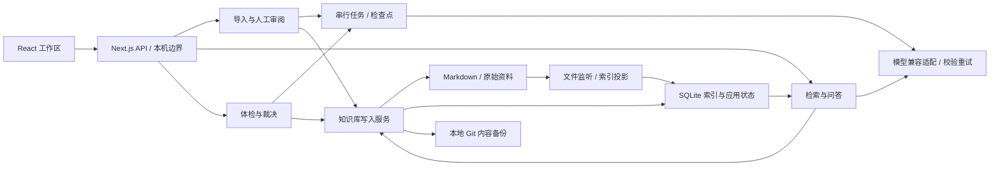

# 架构与工程取舍

织识运行在本机单用户进程中：浏览器承载操作界面，Next.js Node 路由调用领域服务，知识库目录保存文件和 SQLite。无需向量数据库或独立消息队列。

## 模块与数据流

| 模块 | 职责 |
| --- | --- |
| `app/` | 薄页面入口、API 输入校验与统一响应、本机请求边界 |
| `components/`、`hooks/` | 页面工作区、通用控件、请求取消、流式展示与人工操作 |
| `lib/vault/` | 文件事务、冲突保护、知识库迁移、归档与恢复 |
| `lib/db/`、`drizzle/` | 类型化查询、应用状态、版本化数据库迁移 |
| `lib/index/` | Markdown 索引、文件监听、目录与双链；不回写用户正文 |
| `lib/ingest/`、`lib/jobs/` | 解析、分段分析、草稿与队列、检查点、取消和恢复 |
| `lib/chat/` | 检索、上下文预算、摘要、引用校验、会话与阅读附件 |
| `lib/llm/`、`lib/review/`、`lib/lint/` | 模型协议与能力、结构化输出、确定性检查和语义裁决 |

## 三种持久化各司其职

- **Markdown** 保存知识内容和链接；外部编辑由 watcher 重建索引。自动修改经过领域写入服务，避免文件、引用和索引不一致。
- **SQLite** 同时保存可重建索引，以及不可重建的聊天、来源、草稿、任务、裁决和模型配置。FTS5 trigram 支持中文片段检索，短词用有界 LIKE 查询兜底。
- **Git** 记录知识库内容变化；不包含数据库，不能恢复全部应用状态。代码仓库和知识库是两个独立仓库。完整备份必须保留全部知识库文件。

数据库启用 WAL、外键和超时，启动时执行提交到仓库的迁移。开发热更新使用进程级连接缓存；不支持多应用进程同时写同一知识库。

## 导入、问答与体检

导入先保存原件并解析，长文按预算分段，模型分析和草稿逐步写检查点。人工编辑的草稿有版本冲突保护；提交时再次检查词条内容哈希，再统一写入。资料或知识库变化时重新生成过期建议。

问答从索引选取候选，仅加载相关词条片段，按窗口预算组合问题、历史、摘要和证据。轻量摘要根据自身模型窗口控制输入。流式正文定期保存，引用编号由后端核验和回填；HTML 附件独立保存，不进入后续模型历史。

体检的死链、孤儿页和统计由程序确定；矛盾、重复和过时判断交给模型。处理方向经用户提交后可直接执行修订、合并或软删除，执行前检查内容哈希，过期项跳过并报告。裁决约束只回灌已由用户确认的标题和说明。

## 可靠性与安全边界

- 写入单个文件采用临时文件加 rename；跨文件操作用内存快照配合 SQLite 事务，最后完成 Git 提交。可捕获的失败会尝试恢复所有文件及原有暂存；恢复不完整时明确报告并要求停止写入。
- 这不是跨文件系统、SQLite 和 Git 的分布式事务。进程被强制终止、设备故障或回滚再次失败仍需完整备份恢复，不能保证所有断电点都原子完成。
- 后台队列在进程内串行运行，任务与分段结果持久化；重启可恢复导入和体检，尚未完成的单次请求可能重做。中断聊天保留已保存正文并标为失败。
- 标准启动仅监听回环地址；API 验证本机 Host 和同源 Origin。没有账号认证或多人共享能力。
- 凭据仅由服务端读取，对外使用脱敏视图；本地存储不加密。上游错误正文不透传，资料和摘要作为不可信内容注入，个性化只控制表达。
- HTML 阅读采用无同源权限的 sandbox iframe 和 CSP，限制网络、外部资源、表单与导航。下载文件与安全预览版本独立。
- 页面请求取消过期响应，并区分失败和无结果；模型列表按需加载，检索、上下文和输出均有预算。

## 为什么保持这套结构

本地文件、SQLite 与单进程任务队列足够支持当前产品，减少安装和运维负担。模型差异集中在兼容适配器及能力模块，业务层通过结构化类型调用；输出仍必须经 Zod 和引用校验。

当前检索优先使用可解释的全文索引；短词、大库和复杂长问题仍有成本。前端沿用小型请求 hook，没有额外引入跨页面缓存框架。大型工作区与流水线是后续维护重点，但首版不为未验证需求增加抽象。

验收使用隔离数据，并区分协议回归、真实回答质量和性能基准。详见 [验收记录](validation.md)、[性能基准](performance-audit.md)、[模型协议验证](model-service-validation.md)和[界面验收](interface.md)。
