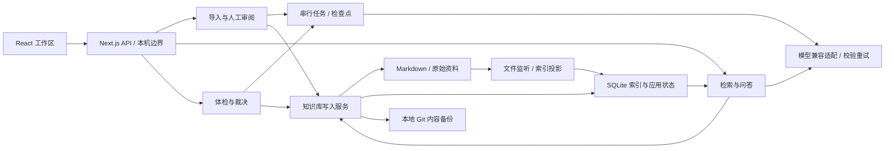

# 架构与工程取舍

织识运行在本机单用户进程中：浏览器承载操作界面，Next.js Node 路由调用领域服务，知识库目录保存文件和 SQLite。无需向量数据库或独立消息队列。

## 模块与数据流

| 模块 | 职责 |
| --- | --- |
| `app/` | 薄页面入口、API 输入校验与统一响应、本机请求边界 |
| `components/`、`hooks/` | 页面工作区、通用控件、请求取消、流式展示与人工操作 |
| `lib/vault/` | 文件事务、冲突保护、知识库迁移、归档与恢复 |
| `lib/db/`、`drizzle/` | 类型化查询、应用状态、版本化数据库迁移 |
| `lib/index/` | Markdown 索引、文件监听、目录与双链；不回写用户正文 |
| `lib/ingest/`、`lib/jobs/` | 解析、分段分析、草稿与队列、检查点、取消和恢复 |
| `lib/chat/` | 检索、上下文预算、摘要、引用校验、会话与阅读附件 |
| `lib/llm/`、`lib/review/`、`lib/lint/` | 模型协议与能力、结构化输出、确定性检查和语义裁决 |

## 三种持久化各司其职

- **Markdown** 保存知识内容和链接；外部编辑由 watcher 重建索引。自动修改经过领域写入服务，避免文件、引用和索引不一致。
- **SQLite** 同时保存可重建索引，以及不可重建的聊天、来源、草稿、任务、裁决和模型配置。FTS5 trigram 支持中文片段检索，短词用有界 LIKE 查询兜底。
- **Git** 记录知识库内容变化；不包含数据库，不能恢复全部应用状态。代码仓库和知识库是两个独立仓库。完整备份必须保留全部知识库文件。

数据库启用 WAL、FULL 同步、外键和超时，启动时执行提交到仓库的迁移。名称和向量属于派生索引：触发器维护名称，并在正文哈希、标题、路径或状态变化时使旧向量失效。全文、名称和链接重建在同一个 SQLite 事务内发布。开发热更新使用进程级连接缓存；不支持多应用进程同时写同一知识库。

## 导入、问答与体检

导入先保存原件并解析，长文按预算分段，模型分析和草稿逐步写检查点。人工编辑的草稿有版本冲突保护；提交时再次检查词条内容哈希，再统一写入。资料或知识库变化时重新生成过期建议。

问答从索引选取候选，仅加载相关词条片段，按窗口预算组合问题、历史、摘要和证据。轻量摘要根据自身模型窗口控制输入。流式正文定期保存，引用编号由后端核验和回填；HTML 附件独立保存，不进入后续模型历史。

混合检索使用独立的嵌入／重排配置，默认关闭。启用后，后台按重叠分段生成向量并保存到 SQLite；更新可继续处理缺失词条。查询将标题／别名、FTS5 BM25 与余弦向量召回通过 RRF 合并，再扩展一跳关系，并对有界候选做语义重排。只有最终上下文进行引用编号。向量服务失败继续文字检索，重排失败保留召回顺序；取消信号传到在途请求。网络等待后再次核对文件与索引哈希，避免将外部编辑之前的正文写入新向量缓存。

当前本地向量搜索采用精确扫描派生向量，不查询整库 Markdown。其成本随向量分段数和维度增长；尚未引入近似向量索引或聊天模型查询改写。向量未建完的词条仍可参与文字召回；启用云端配置会发送词条分段与用户查询，重排仅发送候选片段。

体检的死链、孤儿页和统计由程序确定；矛盾、重复和过时判断交给模型。处理方向经用户提交后可直接执行修订、合并或软删除，执行前检查内容哈希，过期项跳过并报告。裁决约束只回灌已由用户确认的标题和说明。

## 可靠性与安全边界

- 写入单个文件采用唯一临时文件、文件 fsync、原子发布与目录同步。跨文件修改和归档操作在首次变更前持久化恢复日志，SQLite 提交标记与业务数据同事务写入；启动时完成或回滚中断事务，并清理本应用命名的临时文件。涉及引用的写入也核对首次读取版本。
- 恢复前核对内容哈希；遇到外部编辑保留原文件与日志，并阻止继续写入，避免恢复覆盖用户的新内容。故障测试覆盖改名、清空、恢复和清理回收站的 SIGKILL 写入及提交阶段。硬件损坏、文件系统不支持同步或恢复再次失败仍需要完整备份，不宣称覆盖所有断电点。
- Git 在业务事务提交后尽力备份，限制进程运行时间与输出体积。hook、锁或提交故障返回“内容已保存，备份失败”，不回滚本次保存；保留其他 Git 进程的锁。
- 后台队列在进程内串行运行，任务与分段结果持久化；重启可恢复导入和体检，尚未完成的单次请求可能重做。中断聊天保留已保存正文并标为失败。
- 标准启动仅监听回环地址；API 验证本机 Host 和同源 Origin。没有账号认证或多人共享能力。
- 凭据仅由服务端读取，对外使用脱敏视图；本地存储不加密。上游错误正文不透传，资料和摘要作为不可信内容注入，个性化只控制表达。
- HTML 阅读同时使用 iframe sandbox 与响应头 CSP sandbox，允许内联脚本交互但禁止同源权限、网络、外部资源、表单与嵌套页面。预览通过有 CSP 响应头的 URL 加载；即使 iframe 属性误加 allow-same-origin，响应头仍保持不透明来源。JSON 预览分支也设置 CSP；下载文件与安全预览版本独立。
- 页面请求取消过期响应，并区分失败和无结果；模型列表按需加载，检索、上下文和输出均有预算。

## 为什么保持这套结构

本地文件、SQLite 与单进程任务队列足够支持当前产品，减少安装和运维负担。模型差异集中在兼容适配器及能力模块，业务层通过结构化类型调用；输出仍必须经 Zod 和引用校验。

中文查询优先使用 ICU 词语分段，再用有界字串补召回；文字检索可独立运行。混合检索带来语义候选与网络成本，需要用真实语料评估相关性。前端按知识、会话、审阅和设置范围失效查询，避免每次写入刷新全部侧栏数据；导入状态集中到 reducer，聊天消息与归档、导入选择与审阅、词条操作、审阅卡片和导航行按已有职责拆成模块。扫描与导入流水线仍较大，后续修改继续沿稳定边界拆分。

验收使用隔离数据，并区分协议回归、真实回答质量和性能基准。详见 [验收记录](validation.md)、[性能基准](performance-audit.md)、[模型协议验证](model-service-validation.md)和[界面验收](interface.md)。

## 真实质量评测

`scripts/retrieval-eval.mts` 在独立临时知识库复用上述检索、索引和问答入口，提供数据准备、开发测量、排序探索、方案冻结、留出比较及逐题问答复核。个人数据库只读获取检索配置；真实向量与重排响应按模型、内容及参数缓存，重放质量与网络延迟分开报告。检索内部可选追踪不改变 HTTP 接口。测试数据、代码与依赖哈希一并冻结，已曝光留出集通过一次性锁关闭，后续优化必须换未使用的问题及正例文章。Go 问答使用独立凭据和跨运行累计账本，额度不足或窗口结束即停止。详见 [评测说明](retrieval-evaluation.md)。
