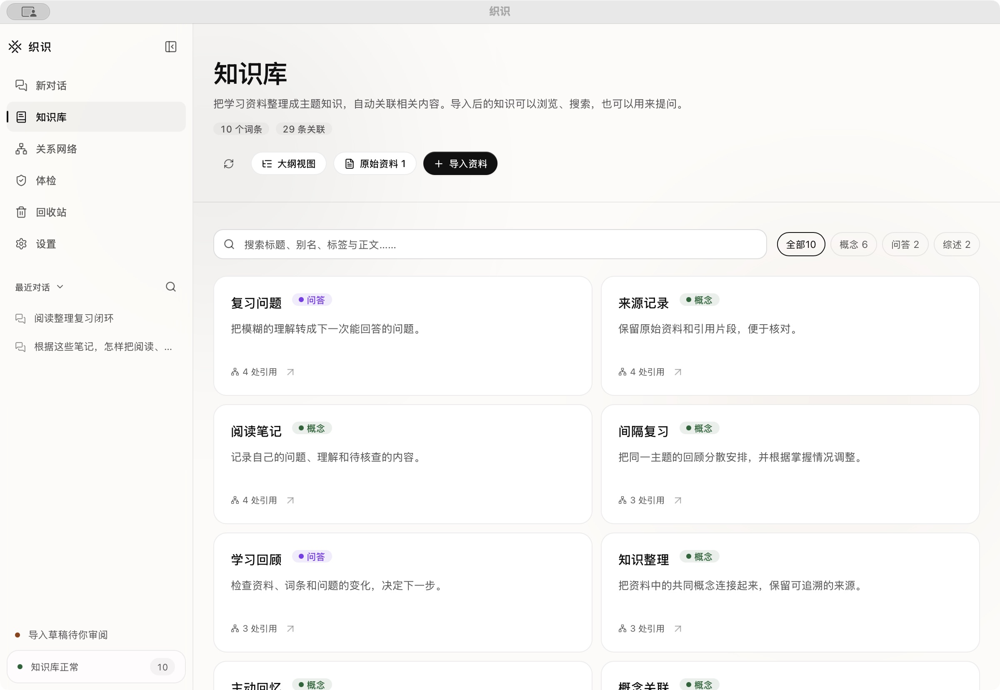

# macOS 桌面应用

[下载 v0.2.3 Apple Silicon DMG](https://github.com/qinyuhao84-ship-it/weave/releases/download/v0.2.3/Weave-0.2.3-macOS-arm64.dmg) · [更新与 SHA-256](https://github.com/qinyuhao84-ship-it/weave/releases/tag/v0.2.3)

## 安装与首次使用

打开 DMG，将「织识」拖到「Applications」，弹出磁盘映像，从应用程序打开织识。应用内置运行时与本地备份所需 Git，基础功能无需 Node、pnpm、Xcode 或终端。首次打开会建立默认知识库 `~/Documents/织识`；位置配置与日志在 `~/Library/Application Support/Weave`。如果已有同名知识库，会读取现有资料，不创建演示内容。

在「设置 → 模型服务」填写自己的服务与型号；没有模型也可浏览、编辑和搜索。混合检索需单独配置嵌入/重排。Markdown、纯文本、HTML、DOCX 与数字 PDF 有基础解析；此桌面版没有捆绑 Docling、OCR 模型或 Python，高质量 OCR/PPTX 需另行配置解析服务。

此包为 **ad-hoc 签名的桌面预览版，尚未 Apple Developer ID 签名和公证**。下载后的首次启动可能被 macOS 阻止；请核对 Release 来源与 SHA-256，并依据系统「隐私与安全性」提示决定是否允许打开。不要关闭 Gatekeeper。未将本机无隔离标记的安装测试解释为互联网下载后的公证验证。



画面使用独立示例知识库，版本与拍摄来源见[截图说明](screenshots/README.md)。

仅提供 Apple Silicon（M 系列）包，构建最低 macOS 13.5，当前实测环境为 macOS 15.7.4 / Apple M2。Intel、Windows、Linux 无此桌面安装包；其他系统版本尚未逐一验收。

## 升级、卸载与备份

退出织识后复制整个知识库，包含隐藏的 `.weave` 与 `.git`，再用新应用替换 Applications 中的旧应用。SQLite 包含会话、导入任务与审阅记录，不能按缓存删除。卸载应用不会自动删除知识库。位置迁移继续使用「设置」现有流程，目标存在冲突时不会覆盖。

应用以 `org.weave.desktop` 标识避免重复启动同一桌面实例。请先关闭另行启动的源码服务，避免两个服务同时操作同一知识库。

## 实现与构建

原生 Cocoa 窗口承载 WKWebView，自动启动随包提供的 Next.js standalone 服务，仅监听 `127.0.0.1` 的动态端口。保留现有 API、存储和模型配置；外部链接交给默认浏览器。没有 Node 页面桥接，网页无法直接调用系统命令。文件上传使用系统打开面板，下载使用保存面板。

```bash
pnpm install --frozen-lockfile
pnpm build
pnpm package:mac
hdiutil verify dist/Weave-0.2.3-macOS-arm64.dmg
```

安装包构建默认写入 `dist/`；为避免覆盖既有 Release 文件，可指定独立输出目录。实际 DMG 验收会只读挂载映像、复制到临时安装目录，并以临时知识库完成导入、检索、模拟问答、重启与完整备份：

```bash
WEAVE_DESKTOP_OUTPUT_DIR=dist/quality-2026-10-03 pnpm package:mac
pnpm verify:desktop -- dist/quality-2026-10-03/Weave-0.2.3-macOS-arm64.dmg
```

完整模式会启动实际 Cocoa 应用并检查重复启动是否复用现有实例。GitHub workflow 使用 `--service-only`，只验收包内 Node、standalone 服务和数据流程，不把无窗口 runner 的结果算作原生窗口验收。验收会在 DMG 旁写入机器记录；未设置 Developer ID 时清单明确标记为 ad-hoc 预览包。

构建需要 Apple Silicon macOS、Xcode Command Line Tools（Swift/C 编译）、固定 Node/pnpm 和网络；使用官方 Node 26.3.1 与 Git 2.56.0 源码，并校验固定 SHA-256。Git 仅承担本地备份，其官方 C 构建采用 `NO_RUST / NO_OPENSSL / NO_CURL / NO_EXPAT / NO_TCLTK / NO_GETTEXT / NO_PERL / NO_PYTHON=YesPlease`、`MACOSX_DEPLOYMENT_TARGET=13.5`，不提供网络同步功能。官方源码与 GPLv2 许可随 Release 提供。Node、Git、所有生产依赖的许可文件与清单在包内 `Contents/Resources/licenses/`。

脚本删除 standalone 可能复制的环境文件、SQLite 和本地缓存，检查所有依赖软链接都留在包内，执行签名完整性检查，再生成 DMG。`WEAVE_DESKTOP_TEST_ROOT` 只用于隔离安装验收，不改变日常配置。手动 GitHub Actions 工作流可重新构建安装包，不调用真实模型。

[当前安装与版本验收](release-validation-2026-10-05.md) · [v0.2.0 历史验收](desktop-validation.md) · [真实质量评测](evaluation/2026-10-02/README.md)
